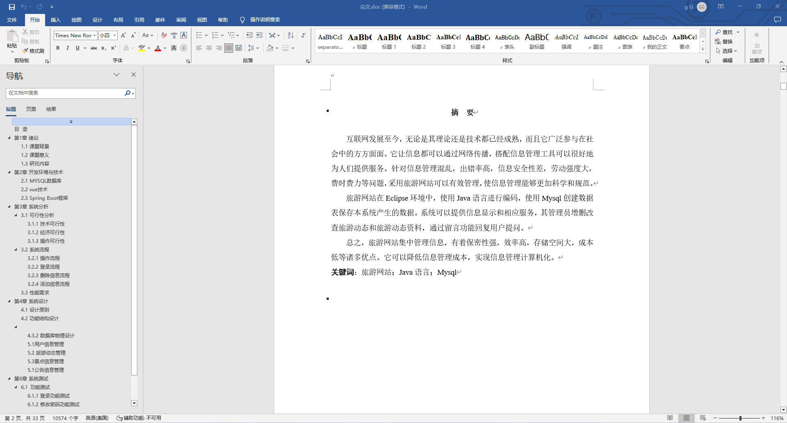
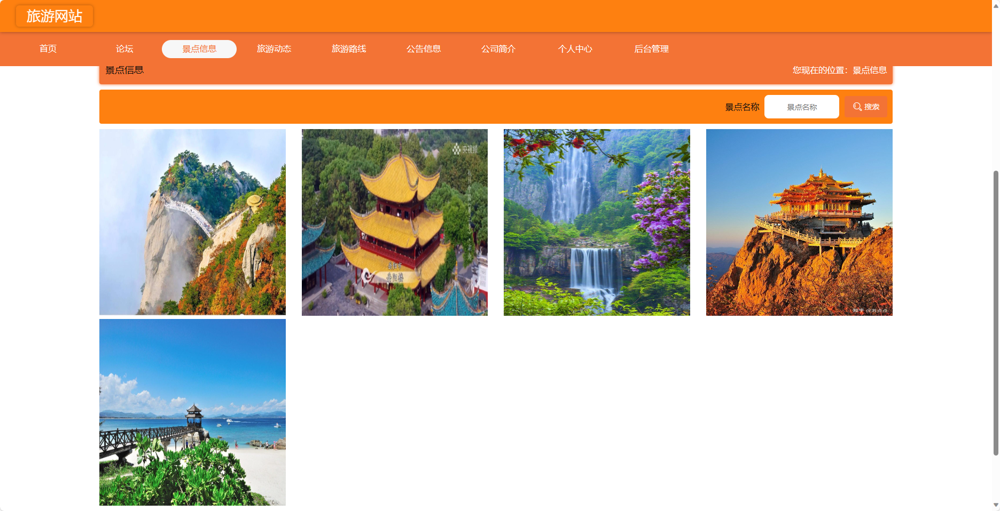
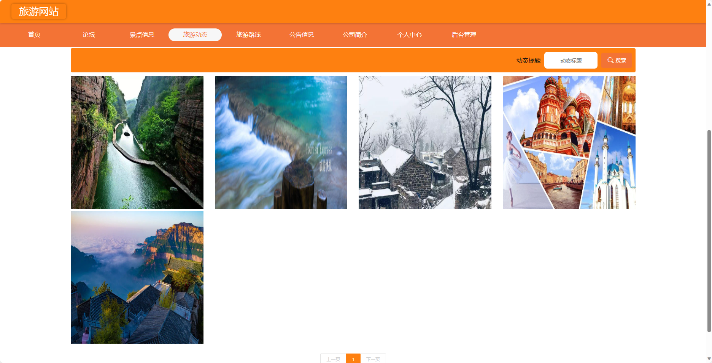

基于SpringBoot的旅游网站（程序+论文）
=
- 完整代码获取地址：从戎源码网 ([https://armycodes.com/](https://armycodes.com/))
- 作者微信：19941326836  QQ：952045282 
- 承接计算机毕业设计、Java毕业设计、Python毕业设计、深度学习、机器学习
- 选题+开题报告+任务书+程序定制+安装调试+论文+答辩ppt 一条龙服务
- 所有选题地址https://github.com/nature924/allProject

一、项目介绍
---
基于Spring Boot框架实现的旅游网站，系统包含两种角色：管理员、用户,系统分为前台和后台两大模块，主要功能如下。
### 前台：

首页：展示旅游网站的相关内容。
论坛：用户可以在论坛中进行旅游交流和分享。
景点信息：浏览和搜索旅游景点信息。
旅游动态：查看最新的旅游动态信息。
旅游路线：浏览和搜索旅游路线信息。
公告信息：查看最新的旅游网站公告信息。
公司简介：了解旅游网站的公司背景和发展历程。
个人中心：管理个人信息，包括订单记录、个人设置等。

### 后台（管理员）：

个人中心：管理个人信息。
管理员管理：管理其他管理员账号的信息。
基础数据管理：管理系统中的基础数据，例如城市信息、旅游类型等。
论坛管理：管理论坛帖子和评论，包括审核和删除等操作。
景点信息管理：管理旅游景点信息，包括添加、编辑、删除景点等操作。
旅游动态管理：发布和管理最新的旅游动态信息。
旅游路线管理：管理旅游路线信息，包括添加、编辑、删除路线等操作。
公告信息管理：发布和管理最新的旅游网站公告信息。
公司简介管理：编辑和更新旅游网站的公司背景和发展历程。
用户管理：管理用户账号信息，包括添加、编辑、删除用户等操作。
轮播图信息：管理系统的轮播图信息，包括添加、编辑、删除等操作。

### 用户：

个人中心：管理个人信息，包括订单记录、个人设置等。
论坛管理：参与旅游相关的论坛交流，发表帖子和评论。
景点信息管理：查看旅游景点信息，包括景点介绍、图片等。
旅游动态管理：查看最新的旅游动态信息。
旅游路线管理：查看旅游路线信息，包括路线介绍、行程安排等。
公告信息管理：查看最新的旅游网站公告信息。

二、项目技术
---
- 编程语言：Java
- 数据库：MySQL
- 项目管理工具：Maven
- 前端技术：VUE、HTML、Jquery、Bootstrap
- 后端技术：Spring、SpringMVC、MyBatis

三、运行环境
---
- 操作系统：Windows、macOS都可以
- JDK版本：JDK1.8以上都可以
- 开发工具：IDEA、Ecplise、Myecplise都可以
- 数据库: MySQL5.7以上都可以
- Tomcat：任意版本都可以
- Maven：任意版本都可以

四、运行截图
---
### 论文截图：

### 程序截图：

